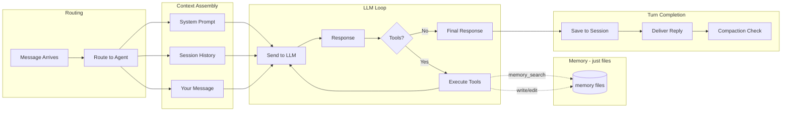
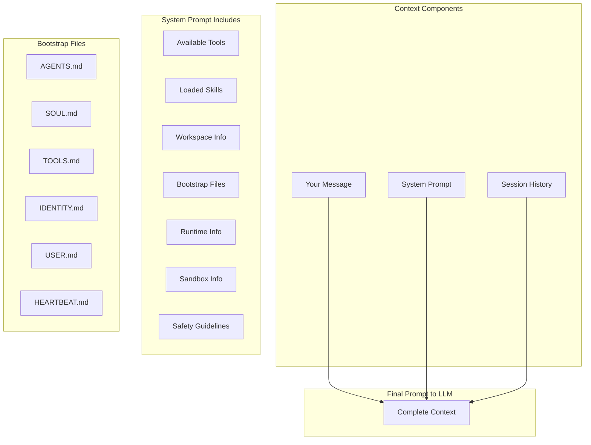
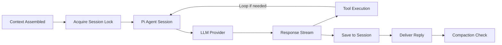

# Agent Context and Runtime

What happens when your message reaches the agent - how context is assembled and sent to the LLM.

## Overview

Once your message is routed to an agent (typically `agent:main:main` for the default agent), the runtime assembles all the context needed to generate a meaningful response. This includes your message, conversation history, system instructions, and workspace context files.

OpenClaw uses [Pi Agent](https://github.com/badlogic/pi-mono) (`@mariozechner/pi-coding-agent`) as its agent runtime, wrapped in `pi-embedded-runner` to integrate with sessions and channels. Pi Agent handles the agentic loop - sending prompts to the LLM, parsing tool calls, executing tools, and continuing until the agent produces a final response.

This doc explains what goes into that context and how it flows through the runtime.



## Context Assembly

When you send a message, the runtime assembles several pieces of context before calling the LLM:



### 1. Your Message

Your actual message text, plus any media (images, files) you attached. The message is wrapped with metadata:

```
[Telegram From YourName 2024-01-15 10:30:00] Did the test implementations complete?
```

**No additional context is injected.** There's no automatic "remember X, Y, Z" prepended to your message. Memory recall happens via tool calls during the agent loop (see [Memory System](#memory-system)).

### 2. System Prompt

The system prompt tells the LLM who it is and what it can do. Built by `buildAgentSystemPrompt()` with these major sections:

| Section | Purpose | Conditional? |
|---------|---------|--------------|
| Identity | Base identity line ("You are a personal assistant running inside OpenClaw.") | Always |
| Tooling | Available tools with descriptions, tool call style guidance | Always |
| Safety | Safety guidelines (no self-preservation, human oversight priority) | Always |
| CLI Reference | OpenClaw command reference | Always |
| Skills | Discovered skills from workspace | If skills found |
| Memory Recall | Instructions for using memory_search/memory_get | If memory tools available |
| Self-Update | Gateway update instructions | If gateway tool available |
| Model Aliases | Shorthand model names | If aliases configured |
| Workspace | Working directory, workspace notes | Always |
| Documentation | Docs paths, community links | Full mode only |
| Sandbox | Sandbox environment details | If sandboxed |
| User Identity | Authorized sender info | Full mode only |
| Time | Current timezone | If timezone configured |
| Reply Tags | How to request native replies | Full mode only |
| Messaging | Cross-session messaging guidance | Full mode only |
| Voice (TTS) | Text-to-speech hints | If TTS configured |
| Reactions | Emoji reaction guidance | If reactions enabled |
| Reasoning Format | `<think>/<final>` tag instructions | For reasoning models |
| Bootstrap Files | Workspace context files (see below) | Always (content varies) |
| Silent Replies | NO_REPLY usage | Full mode only |
| Heartbeats | Heartbeat handling instructions | Full mode only |
| Runtime | Model, host, channel, capabilities | Always |

### Prompt Modes

Not every agent session needs the full system prompt. OpenClaw uses three modes:

| Mode | When Used | What's Included |
|------|-----------|-----------------|
| `full` | Main agent sessions (you chatting via Telegram, CLI, etc.) | Everything |
| `minimal` | Subagent sessions spawned via `sessions_spawn` | Tooling, Workspace, Safety, Runtime + AGENTS.md, TOOLS.md only |
| `none` | Minimal agents (rare) | Just the identity line |

The mode is determined by checking the session key. If it's a subagent session key (contains `:subagent:`), the mode is `minimal`. Otherwise, it's `full`.

### Bootstrap Files

Bootstrap files are markdown files in your workspace that customize the agent's behavior. They're read from disk and injected verbatim into the system prompt's `# Project Context` section.

| File | Purpose | In Subagent? |
|------|---------|--------------|
| `AGENTS.md` | Agent behavior instructions | Yes |
| `SOUL.md` | Personality and communication style | No |
| `TOOLS.md` | Guidance on how to use specific tools | Yes |
| `IDENTITY.md` | Additional identity context | No |
| `USER.md` | User preferences and context | No |
| `HEARTBEAT.md` | Heartbeat prompt customization | No |
| `BOOTSTRAP.md` | General bootstrap context | No |
| `MEMORY.md` | Long-term memory (curated) | No |

When running in `minimal` mode (subagents), only files marked "Yes" are injected. The others are filtered out to keep the subagent prompt lean and avoid leaking personal context.

**Truncation**: Each file is truncated individually if it exceeds the configured limit (default 20,000 characters via `agents.defaults.bootstrapMaxChars`). The truncation keeps 70% from the head and 20% from the tail, inserting a marker in the middle.

**Total Budget**: There's also a total budget across all bootstrap files (`agents.defaults.bootstrapTotalMaxChars`). If the combined size exceeds this, files are proportionally truncated with warnings injected into the prompt.

### 3. Session History

Previous conversation turns from the session file. Each turn includes:
- Role (user/assistant)
- Content (message text)
- Tool calls and results (if any)
- Timestamps

History is loaded from the session's `.jsonl` file and provides conversation continuity.

For the full construction flow, see [Session History Construction](session-history-construction.md).

## Agent Execution Flow

Once context is assembled, it flows through the agent runtime:



1. **Context Assembled** - System prompt (with bootstrap files), history, your message
2. **Acquire Session Lock** - Prevents concurrent writes to the same session file
3. **Pi Agent Session** - Creates or resumes a Pi Agent session
4. **LLM Provider** - Sends to Claude, GPT, Gemini, or local model
5. **Response Stream** - Streams response tokens back
6. **Tool Execution** - If the LLM requests tools, they're executed and results fed back
7. **Save to Session** - Appends the turn to session history
8. **Deliver Reply** - Sends response back to the channel
9. **Compaction Check** - If context is near the limit, compress older history

### What Pi Agent Does vs What OpenClaw Does

Pi Agent is a generic coding agent library. OpenClaw wraps it and adds everything that makes it "OpenClaw":

| Layer | Responsibility |
|-------|----------------|
| **Pi Agent** | Core file tools (`bash`, `read`, `write`, `edit`, `grep`, `find`, `ls`), LLM session management, tool execution loop, response streaming |
| **OpenClaw** | System prompt, channels (Telegram, WhatsApp...), custom tools (`browser`, `message`, `cron`...), sandboxing, routing, skills, memory, hooks |

The system prompt is entirely OpenClaw's - Pi Agent receives it as a parameter. Sandboxing (Docker execution) is also OpenClaw's - Pi Agent just runs commands locally by default.

For a deeper dive into this architecture, see [OpenClaw vs Pi Agent Runtime](clawdbot-vs-pi-agent.md).

### Sandbox Support

When sandboxing is enabled, OpenClaw:
1. Spins up a Docker container
2. Mounts the workspace (read-only or read-write based on config)
3. Routes Pi Agent's `bash`/`exec` calls to run inside the container
4. Applies tool policies (some tools blocked in sandbox mode)
5. Optionally allows elevated exec (commands that run on the host with approval)

The agent receives sandbox info in its system prompt so it knows the environment constraints.

### Session Write Locking

OpenClaw uses file-based write locks to prevent concurrent modifications to session files. The lock is held for the duration of the agent run, with a maximum hold time derived from the run timeout.

This prevents race conditions when:
- Multiple messages arrive rapidly
- Heartbeats overlap with user messages
- Subagents run concurrently with main sessions

### Memory System

Memory is just **files + instructions** - no special learning mechanism.

**Reading memory**: OpenClaw provides `memory_search` and `memory_get` tools. The system prompt instructs: *"Before answering anything about prior work, decisions, dates, people, preferences, or todos: run memory_search..."*

**Writing memory**: Uses Pi Agent's standard `write` and `edit` tools. The `AGENTS.md` bootstrap file instructs the agent:
```
## Memory
- Daily log: memory/YYYY-MM-DD.md
- Long-term memory: MEMORY.md for durable facts, preferences, decisions
```

When you say "remember I prefer TypeScript":
1. Agent follows AGENTS.md instructions
2. Agent calls `write` or `edit` to update `MEMORY.md` or `memory/YYYY-MM-DD.md`
3. This is a normal tool call during the agent loop - not post-processing

There's no automatic preference extraction. Nothing is written unless the agent decides to (based on your request and AGENTS.md guidance).

**Memory citations**: Configurable via `memory.citations` - can be `"off"` to suppress file paths/line numbers in replies, or default to include them for verification.

## Plugin Hooks

OpenClaw supports plugin hooks that can modify context assembly:

| Hook | When | Purpose |
|------|------|---------|
| `before_prompt_build` | Before system prompt is built | Inject context, modify prompt |
| `before_agent_start` | Before agent loop begins | Legacy hook for prompt context |

Plugins can inject RAG results, memory snippets, or other context via these hooks. **There is no built-in RAG** - the agent is instructed (via system prompt) to use `memory_search` tool, but that's agent-initiated.

## Skills Runtime

Skills are discovered from the workspace and system skill directories. Each skill provides:
- A `SKILL.md` file with instructions
- Optional scripts and assets
- Environment variable overrides

The skills prompt is injected into the system prompt with this pattern:
```
<available_skills>
  <skill>
    <name>github</name>
    <description>Interact with GitHub using the gh CLI...</description>
    <location>/path/to/SKILL.md</location>
  </skill>
</available_skills>
```

The agent is instructed to scan skill descriptions and read the relevant SKILL.md when a task matches.

## Turn Completion

When the agent produces its final response (no more tool calls), the turn is complete:

1. **Response appended** to session `.jsonl` file
2. **Reply delivered** to the originating channel (Telegram, WhatsApp, etc.)
3. **Usage tracked** (tokens, model, provider) in session metadata
4. **Compaction check** - Pi Agent checks if context is near the limit and proactively compacts history if needed

There's no automatic learning or preference extraction after each turn. For details on session persistence and memory mechanisms, see [Session Persistence](conversation-history.md).

## Provider-Specific Handling

OpenClaw handles quirks of different LLM providers:

| Provider | Handling |
|----------|----------|
| Google/Gemini | Turn validation (user→assistant alternation), tool schema sanitization |
| Anthropic | Turn validation, thinking block handling |
| Ollama | Native `/api/chat` streaming, `num_ctx` injection for OpenAI-compat mode |
| OpenAI | WebSocket streaming for Responses API, function call downgrading |
| Mistral | Tool call ID sanitization (format requirements) |

These are transparent to the agent - OpenClaw's `sanitizeSessionHistory()` and stream wrappers handle them.

## Tool Name Normalization

Models sometimes emit tool names with whitespace or case variations. OpenClaw normalizes these before dispatch:
- Trims whitespace from tool names
- Case-insensitive matching against allowed tools
- Falls back to original name if no match found

## Key Code Locations

| Component | File |
|-----------|------|
| Main run entry | `src/agents/pi-embedded-runner/run.ts` |
| Attempt execution | `src/agents/pi-embedded-runner/run/attempt.ts` |
| System prompt builder | `src/agents/system-prompt.ts` |
| System prompt params | `src/agents/system-prompt-params.ts` |
| Session history | `src/agents/pi-embedded-runner/history.ts` |
| Bootstrap files | `src/agents/bootstrap-files.ts` |
| Bootstrap budget | `src/agents/bootstrap-budget.ts` |
| Skills runtime | `src/agents/pi-embedded-runner/skills-runtime.ts` |
| Tool creation | `src/agents/pi-tools.ts` |
| Sandbox context | `src/agents/sandbox.ts` |
| Session write lock | `src/agents/session-write-lock.ts` |
| Google sanitization | `src/agents/pi-embedded-runner/google.ts` |
| Agent scope | `src/agents/agent-scope.ts` |

## Summary

When you send a message:

1. **Routing** determines the agent and session (`agent:main:main`)
2. **Session lock** acquired to prevent concurrent writes
3. **Context assembly** gathers system prompt (with bootstrap files, safety guidelines, skills), session history, your message
4. **Hooks run** for plugin context injection
5. **Pi Agent** sends everything to the LLM
6. **Response** streams back, tools execute if needed (loop until final response)
7. **Turn completes** - response saved, reply delivered, compaction checked

The context window the LLM sees = system prompt + session history + your message.
