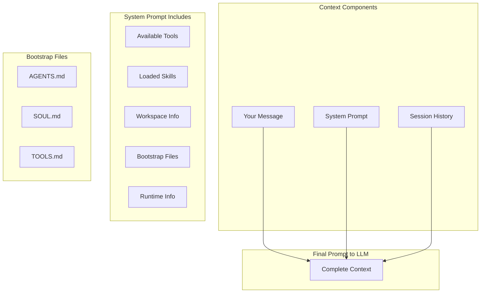
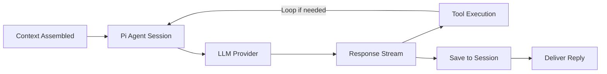

# Agent Context and Runtime

What happens when your message reaches the agent - how context is assembled and sent to the LLM.

## Overview

Once your message is routed to an agent (typically `agent:main:main` for the default agent), the runtime assembles all the context needed to generate a meaningful response. This includes your message, conversation history, system instructions, and workspace context files.

Clawdbot uses [Pi Agent](https://github.com/badlogic/pi-mono) (`@mariozechner/pi-coding-agent`) as its agent runtime, wrapped in `pi-embedded-runner` to integrate with sessions and channels. Pi Agent handles the agentic loop - sending prompts to the LLM, parsing tool calls, executing tools, and continuing until the agent produces a final response.

This doc explains what goes into that context and how it flows through the runtime.

## Context Assembly

When you send a message, the runtime assembles several pieces of context before calling the LLM:



### 1. Your Message

Your actual message text, plus any media (images, files) you attached. The message is wrapped with metadata:

```
[Telegram From YourName 2024-01-15 10:30:00] Did the test implementations complete? What's the status?
```

### 2. System Prompt

The system prompt tells the LLM who it is and what it can do. Built by `buildAgentSystemPrompt()`:

| Section | Content |
|---------|---------|
| Identity | Base identity line ("You are Clawdbot...") |
| Tools | Available tools with descriptions |
| Skills | Loaded skills from workspace |
| Workspace | Current working directory, notes |
| User Identity | Owner info for personalization |
| Runtime | Agent ID, host OS, model in use |
| Guidance | Reply formatting, tool call style, etc. |
| Bootstrap Files | Workspace context files (see below) |

**Bootstrap Files** - These workspace files customize the agent's behavior and are injected into the system prompt:

| File | Purpose |
|------|---------|
| `AGENTS.md` | Agent behavior instructions |
| `SOUL.md` | Personality and communication style |
| `TOOLS.md` | Tool-specific guidance |

Bootstrap files are truncated if too large (70% head + 20% tail, max 20k chars).

For a complete breakdown of all 23 sections that can appear in the system prompt, see [System Prompt Sections](reference/system-prompt-sections.md).

### 3. Session History

Previous conversation turns from the session file. Each turn includes:
- Role (user/assistant)
- Content (message text)
- Tool calls and results (if any)
- Timestamps

History is loaded from the session's `.jsonl` file and provides conversation continuity.

For the full construction flow, see [Session History Construction](session-history-construction.md).

## Agent Execution Flow

Once context is assembled, it flows through the agent runtime:



1. **Context Assembled** - System prompt (with bootstrap files), history, your message
2. **Pi Agent Session** - Creates or resumes a Pi Agent session
3. **LLM Provider** - Sends to Claude, GPT, or local model
4. **Response Stream** - Streams response tokens back
5. **Tool Execution** - If the LLM requests tools, they're executed and results fed back
6. **Save to Session** - Appends the turn to session history
7. **Deliver Reply** - Sends response back to the channel

### What Pi Agent Does vs What Clawdbot Does

Pi Agent is a generic coding agent library. Clawdbot wraps it and adds everything that makes it "Clawdbot":

| Layer | Responsibility |
|-------|----------------|
| **Pi Agent** | Core file tools (`bash`, `read`, `write`, `edit`, `grep`, `find`, `ls`), LLM session management, tool execution loop |
| **Clawdbot** | System prompt, channels (Telegram, WhatsApp...), custom tools (`browser`, `message`, `cron`...), sandboxing, routing |

The system prompt is entirely Clawdbot's - Pi Agent receives it as a parameter. Sandboxing (Docker execution) is also Clawdbot's - Pi Agent just runs commands locally by default.

For a deeper dive into this architecture, see [Clawdbot vs Pi Agent Runtime](clawdbot-vs-pi-agent.md).

## Session Storage

Sessions are stored as newline-delimited JSON files:

```
~/.clawdbot/agents/main/sessions/main.jsonl
```

Each line is a JSON object representing one event in the conversation:

```json
{"role":"user","content":"[Telegram From You...] Hello!","timestamp":1705312200}
{"role":"assistant","content":"Hi there! How can I help?","timestamp":1705312205}
```

The session file grows as you converse. Compaction can summarize older turns to keep context manageable.

## Key Code Locations

| Component | File |
|-----------|------|
| Pi Agent runner | `src/agents/pi-embedded-runner/run.ts` |
| System prompt | `src/agents/system-prompt.ts` |
| Session history | `src/agents/pi-embedded-runner/history.ts` |
| Bootstrap files | `src/agents/bootstrap-files.ts` |
| Agent execution | `src/agents/pi-embedded-runner/run/attempt.ts` |

## Summary

When you send a message:

1. **Routing** determines the agent and session (`agent:main:main`)
2. **Context assembly** gathers system prompt (with bootstrap files), history
3. **Pi Agent** sends everything to the LLM
4. **Response** streams back, tools execute if needed
5. **Session** is updated and reply is delivered

The context window the LLM sees is the sum of all these pieces - system prompt + history + your message.
