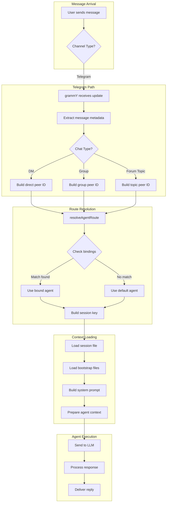
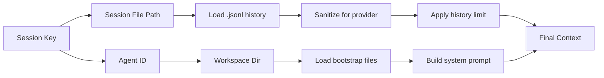

# Message Routing Flow

How an incoming message gets routed to the correct agent session and loads the right context.

## Overview

When a message arrives from any channel (Telegram, Discord, etc.), OpenClaw needs to answer several questions:

1. **Which agent** should handle this message?
2. **What session** should the conversation use?
3. **What context** should be loaded (history, workspace, bootstrap files)?

This document traces that flow, using Telegram as the primary example since it demonstrates all the key concepts.

## The Complete Flow



## Step 1: Message Arrival & Peer Identification

When a message arrives, the first step is identifying the **peer** - who or what sent the message and from where.

### Telegram Example

```typescript
// src/telegram/bot-message-context.ts

const isGroup = msg.chat.type === "group" || msg.chat.type === "supergroup";
const senderId = msg.from?.id ? String(msg.from.id) : "";
const messageThreadId = msg.message_thread_id;  // Forum topic ID
const isForum = msg.chat.is_forum === true;

// Build the peer ID based on context
const peerId = isGroup
  ? buildTelegramGroupPeerId(chatId, resolvedThreadId)   // e.g., "-12345" or "-12345:999"
  : resolveTelegramDirectPeerId({ chatId, senderId });   // e.g., "12345"
```

### Peer Types

| Chat Type | Peer Kind | Peer ID Example | Description |
|-----------|-----------|-----------------|-------------|
| DM | `direct` | `12345` | One-on-one chat with user |
| Group | `group` | `-12345` | Regular group chat |
| Supergroup | `group` | `-100123456` | Large group with features |
| Forum Topic | `group` | `-12345:999` | Topic thread in a forum |
| Channel | `channel` | `@channelname` | Broadcast channel |

### Parent Peer for Threads

For threaded messages (forum topics), OpenClaw also tracks the **parent peer** - the group containing the thread:

```typescript
const parentPeer = buildTelegramParentPeer({ isGroup, resolvedThreadId, chatId });
// For topic 999 in group -12345:
// parentPeer = { kind: "group", id: "-12345" }
```

This allows thread bindings to inherit from their parent group's binding.

## Step 2: Route Resolution

With the peer identified, `resolveAgentRoute()` determines which agent handles the message and what session key to use.

```typescript
// src/telegram/bot-message-context.ts

const route = resolveAgentRoute({
  cfg: loadConfig(),
  channel: "telegram",
  accountId: account.accountId,
  peer: {
    kind: isGroup ? "group" : "direct",
    id: peerId,
  },
  parentPeer,  // For thread inheritance
});
```

### Binding Evaluation Order

The router evaluates bindings in priority order (first match wins):

```
┌─────────────────────────────────────────────────────────────┐
│  1. binding.peer         → Exact chat/group ID match        │
│  2. binding.peer.parent  → Thread inherits parent binding   │
│  3. binding.guild+roles  → Discord guild + role membership  │
│  4. binding.guild        → Discord guild (any role)         │
│  5. binding.team         → Slack workspace                  │
│  6. binding.account      → Specific bot account             │
│  7. binding.channel      → Any account on channel (*)       │
│  8. default              → Default agent                    │
└─────────────────────────────────────────────────────────────┘
```

### Example: Different Bindings, Different Results

```json
{
  "bindings": [
    {
      "agentId": "support",
      "match": { "channel": "telegram", "peer": { "kind": "group", "id": "-12345" } }
    },
    {
      "agentId": "coder", 
      "match": { "channel": "telegram", "accountId": "work-bot" }
    }
  ]
}
```

| Message From | Account | Matched By | Agent | Session Key |
|--------------|---------|------------|-------|-------------|
| Group -12345 | any | binding.peer | support | `agent:support:telegram:group:-12345` |
| Group -99999 | work-bot | binding.account | coder | `agent:coder:telegram:group:-99999` |
| DM to work-bot | work-bot | binding.account | coder | `agent:coder:main` (collapsed) |
| DM to personal | default | default | main | `agent:main:main` |

## Step 3: Session Key Construction

The session key determines where conversation history is stored and how sessions are isolated.

### Session Key Patterns

```typescript
// src/routing/session-key.ts

// DM with default scope (collapsed to main)
`agent:main:main`

// DM with per-peer scope
`agent:main:direct:12345`

// DM with per-channel-peer scope
`agent:main:telegram:direct:12345`

// Group chat
`agent:main:telegram:group:-12345`

// Forum topic (thread suffix)
`agent:main:telegram:group:-12345:thread:999`
```

### DM Session Scopes

The `session.dmScope` config controls DM isolation:

| Scope | Session Key | Isolation Level |
|-------|-------------|-----------------|
| `main` (default) | `agent:main:main` | All DMs share one session |
| `per-peer` | `agent:main:direct:12345` | Each person gets own session |
| `per-channel-peer` | `agent:main:telegram:direct:12345` | Per-person per-channel |
| `per-account-channel-peer` | `agent:main:telegram:default:direct:12345` | Full isolation |

### Identity Linking

With `session.identityLinks`, the same person across channels can share a session:

```json
{
  "session": {
    "dmScope": "per-peer",
    "identityLinks": {
      "alice": ["telegram:12345", "discord:98765"]
    }
  }
}
```

Messages from either ID route to `agent:main:direct:alice`.

## Step 4: Context Loading

Once the route is resolved, OpenClaw loads the context for that session.



### Session File Resolution

```typescript
// Session key → file path
"agent:main:main"                    → ~/.openclaw/agents/main/sessions/main.jsonl
"agent:main:telegram:group:-12345"   → ~/.openclaw/agents/main/sessions/telegram:group:-12345.jsonl
"agent:support:telegram:group:-12345" → ~/.openclaw/agents/support/sessions/telegram:group:-12345.jsonl
```

### Workspace Resolution

Each agent can have its own workspace:

```typescript
// src/agents/agent-scope.ts

const workspaceDir = resolveAgentWorkspaceDir(cfg, agentId);
// Default agent: ~/clawd (or configured workspace)
// Other agents: ~/.openclaw/workspace-{agentId}
```

### Bootstrap Files

Bootstrap files are loaded from the agent's workspace and injected into the system prompt:

| File | Loaded For |
|------|------------|
| `AGENTS.md` | All sessions |
| `SOUL.md` | Main sessions only |
| `TOOLS.md` | All sessions |
| `USER.md` | Main sessions only |
| `MEMORY.md` | Main sessions only |

Subagent sessions (`minimal` prompt mode) only get AGENTS.md and TOOLS.md.

## Step 5: System Prompt Assembly

The system prompt is built with context from the resolved route:

```typescript
// src/agents/pi-embedded-runner/run/attempt.ts

const appendPrompt = buildEmbeddedSystemPrompt({
  workspaceDir: effectiveWorkspace,
  runtimeInfo: {
    agentId: sessionAgentId,
    channel: runtimeChannel,      // "telegram"
    capabilities: runtimeCapabilities, // ["inlineButtons", ...]
    // ...
  },
  contextFiles,  // Bootstrap files
  sandboxInfo,   // If sandboxed
  // ...
});
```

The prompt includes runtime context:
```
Runtime: agent=main | host=MacBook | repo=/Users/you/clawd | os=Darwin 24.0.0 (arm64) | channel=telegram | capabilities=inlineButtons | thinking=off
```

## Putting It All Together: Example Scenarios

### Scenario 1: Telegram DM

```
You → DM to @YourBot → "Hello!"

1. grammY receives update
2. Extract: chatId=12345, isGroup=false, senderId=12345
3. Build peer: { kind: "direct", id: "12345" }
4. resolveAgentRoute:
   - No peer binding matches
   - No account binding matches
   - Falls back to default agent "main"
   - dmScope="main" → sessionKey = "agent:main:main"
5. Load session: ~/.openclaw/agents/main/sessions/main.jsonl
6. Load workspace: ~/clawd
7. Load bootstrap: AGENTS.md, SOUL.md, TOOLS.md, USER.md, MEMORY.md
8. Build system prompt with channel=telegram
9. Send to LLM with history + your message
10. Reply delivered to Telegram DM
```

### Scenario 2: Telegram Group

```
You → Group "-12345" → "@YourBot help me"

1. grammY receives update
2. Extract: chatId=-12345, isGroup=true, senderId=67890
3. Build peer: { kind: "group", id: "-12345" }
4. resolveAgentRoute:
   - Check peer bindings: no match for -12345
   - Check account bindings: no match
   - Falls back to default agent "main"
   - sessionKey = "agent:main:telegram:group:-12345"
5. Load session: ~/.openclaw/agents/main/sessions/telegram:group:-12345.jsonl
6. Load workspace: ~/clawd
7. Load bootstrap files (full mode)
8. Build system prompt with channel=telegram, isGroup=true
9. Check mention requirement (configured per-group)
10. Load recent group history for context
11. Send to LLM
12. Reply to group
```

### Scenario 3: Bound Group with Different Agent

```
You → Group "-99999" (bound to "coder" agent) → "Review this PR"

1. grammY receives update
2. Build peer: { kind: "group", id: "-99999" }
3. resolveAgentRoute:
   - Check peer bindings: MATCH! agentId="coder"
   - sessionKey = "agent:coder:telegram:group:-99999"
5. Load session: ~/.openclaw/agents/coder/sessions/telegram:group:-99999.jsonl
6. Load workspace: ~/.openclaw/workspace-coder (or configured)
7. Load bootstrap from coder's workspace
8. Send to LLM (may use different model if configured)
9. Reply to group
```

### Scenario 4: Forum Topic Inheriting Parent Binding

```
You → Topic 555 in Group "-12345" (group bound to "support") → "Help!"

1. grammY receives update
2. Extract: chatId=-12345, messageThreadId=555
3. Build peer: { kind: "group", id: "-12345:555" }
4. Build parentPeer: { kind: "group", id: "-12345" }
5. resolveAgentRoute:
   - Check peer bindings for "-12345:555": no match
   - Check parent peer bindings for "-12345": MATCH! agentId="support"
   - matchedBy = "binding.peer.parent"
   - sessionKey = "agent:support:telegram:group:-12345:thread:555"
6. Load session with thread-specific history
7. Continue with support agent context...
```

## Key Takeaways

1. **Peer identification** happens first - extract chat type, ID, and optional thread info
2. **Route resolution** matches bindings in priority order (peer → parent → guild → account → channel → default)
3. **Session key** encodes the agent, channel, chat type, and ID
4. **Context loading** is scoped to the resolved agent's workspace and session file
5. **Threads inherit** parent bindings when no direct match exists
6. **DM scope** controls whether DMs are collapsed or isolated per-peer/per-channel

## Code References

| Component | File |
|-----------|------|
| Telegram context building | `src/telegram/bot-message-context.ts` |
| Route resolution | `src/routing/resolve-route.ts` |
| Session key building | `src/routing/session-key.ts` |
| Peer ID helpers | `src/telegram/bot/helpers.ts` |
| Session file paths | `src/agents/session-dirs.ts` |
| Workspace resolution | `src/agents/agent-scope.ts` |
| System prompt assembly | `src/agents/pi-embedded-runner/run/attempt.ts` |
| Reply dispatch | `src/telegram/bot-message-dispatch.ts` |
