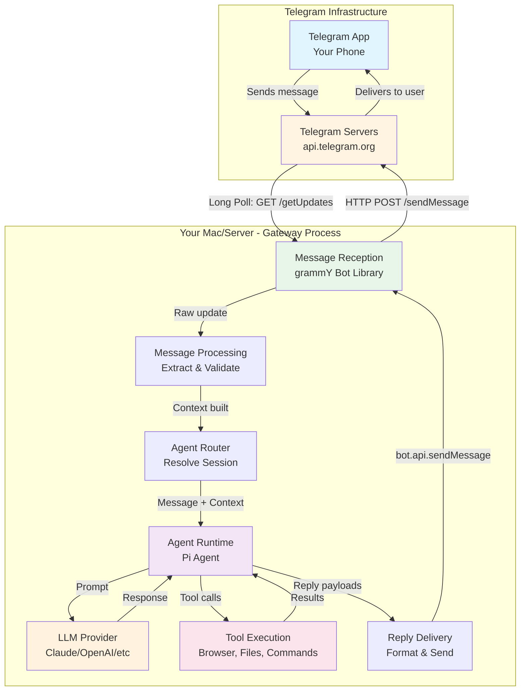

# Telegram Message Flow

How a Telegram message reaches your Clawdbot server and gets processed.

## Overview

Clawdbot connects to Telegram using the [grammY](https://grammy.dev/) library, which handles the Telegram Bot API. The Telegram extension runs **inside** the Gateway process, allowing direct function calls without WebSocket overhead.

## Connection Method: Long Polling

Clawdbot uses **long polling** to receive messages from Telegram. The Gateway continuously polls Telegram's API for new messages:

```
Your Mac/Server (Clawdbot Gateway)
    ↓
[grammY Bot Library]
    ↓
HTTP GET https://api.telegram.org/bot<TOKEN>/getUpdates
    ↓
Telegram Servers respond with new messages
    ↓
grammY processes updates
```

This is the default and recommended method - it works out of the box without requiring a publicly accessible URL or HTTPS setup.

## Complete Message Flow



## Key Code Locations

| Component | File | Purpose |
|-----------|------|---------|
| Connection setup | `src/telegram/monitor.ts` | `monitorTelegramProvider()` starts the grammY bot |
| Bot creation | `src/telegram/bot.ts` | `createTelegramBot()` sets up grammY handlers |
| Message handlers | `src/telegram/bot-handlers.ts` | `registerTelegramHandlers()` registers message handlers |
| Message processing | `src/telegram/bot-message.ts` | `createTelegramMessageProcessor()` processes messages |
| Message dispatch | `src/telegram/bot-message-dispatch.ts` | `dispatchTelegramMessage()` routes to agent |
| Agent execution | `src/auto-reply/reply/agent-runner-execution.ts` | `runAgentTurnWithFallback()` → `runEmbeddedPiAgent()` |
| Reply delivery | `src/telegram/bot/delivery.ts` | `deliverReplies()` sends messages back to Telegram |
| Gateway integration | `extensions/telegram/src/channel.ts` | Plugin that starts Telegram monitor when Gateway starts |

## Processing Steps

1. **Update Reception**: grammY receives update from Telegram via long polling (`getUpdates`)
2. **Handler Registration**: `registerTelegramHandlers()` sets up message handlers
3. **Message Extraction**: Extract text, media, sender info, chat metadata
4. **Access Control**: Check allowlist, DM pairing policy, group mention requirements
5. **Context Building**: Build `MsgContext` with channel, sender, thread info
6. **Agent Routing**: Resolve session key (e.g., `agent:main:telegram:group:12345`)
7. **Agent Execution**: Call `runEmbeddedPiAgent()` which:
   - Loads session history
   - Assembles system prompt (AGENTS.md, SOUL.md, TOOLS.md)
   - Calls LLM (Claude/GPT/local)
   - Executes tools as needed
   - Streams response back
8. **Reply Delivery**: Format response and send via `bot.api.sendMessage()`

## Important Points

1. **In-Process Execution**: The Telegram extension runs **inside** the Gateway process, so it calls agent functions directly (no WebSocket needed). This is different from external clients (CLI, macOS app) which connect via WebSocket.

2. **grammY Library**: Handles all Telegram Bot API communication, including:
   - Long polling (`getUpdates`) - continuously polls for new messages
   - Rate limiting - prevents hitting Telegram API limits
   - Update deduplication - skips duplicate messages
   - Sequential processing - ensures messages are processed in order

3. **Gateway Startup**: When the Gateway starts, it loads all channel extensions (Telegram, WhatsApp, Discord, etc.) and starts their monitors. All run in the same process.

4. **Session Isolation**: Each chat gets its own session key:
   - DMs: `agent:<agentId>:main` (collapsed to single main session per agent)
   - Groups: `agent:<agentId>:telegram:group:<chatId>`
   - Threads: `agent:<agentId>:telegram:group:<chatId>:topic:<threadId>`

5. **Media Handling**: Media files are downloaded to the workspace, processed, and can be included in the agent's context or sent back as replies.

6. **Streaming Support**: Telegram supports draft message streaming for private chats with topics enabled, allowing real-time streaming of agent responses.
